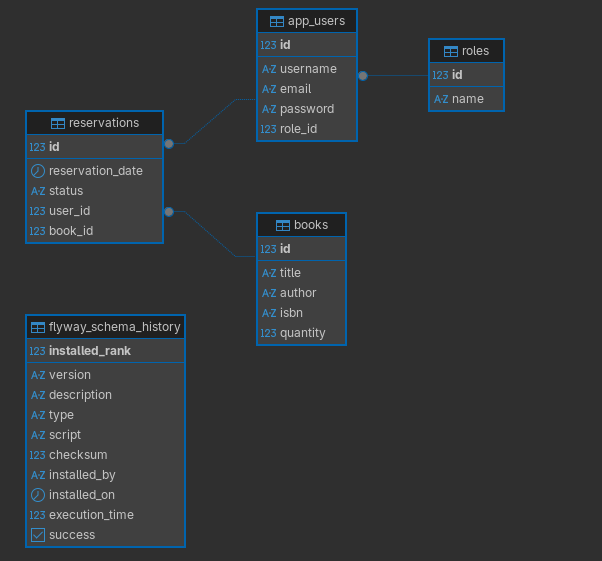
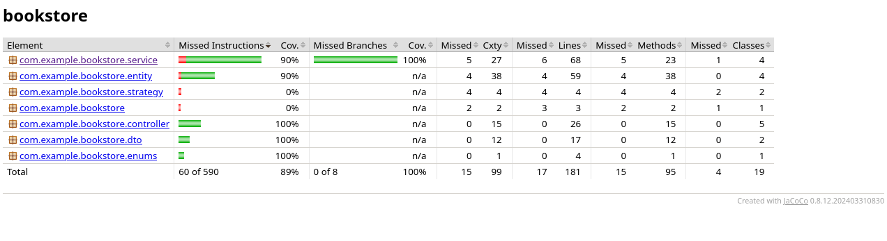

# Bookstore

## Opis projektu

Aplikacja biblioteki umożliwiająca:

- rejestrację użytkowników
- wyszukiwanie książek
- tworzenie rezerwacji
- zarządzanie książkami przez administratora
- zmianę statusów rezerwacji

## Technologie

- Java 21
- Spring Boot
- PostgreSQL
- Flyway
- Docker
- Swagger
- JUnit
- JaCoCo

## Uruchomienie

### Docker

```bash
docker compose up -d
docker compose down -v
```
### Aplikcaja
```bash
mvn clean install
mvn spring-boot:run
```
### Testy
```bash
mvn test
mvn clean test
```

## Swagger

http://localhost:8080/swagger-ui/index.html

## Role użytkowników
### USER
-przeglądanie książek

-wyszukiwanie książek

-tworzenie rezerwacji
### ADMIN
-dodawanie książek

-edycja książek

-usuwanie książek

-zmiana statusu rezerwacji

## Przykładowy użytkownik
### Użytkownik
login: user2

hasło: pass
### Admin
login: admin

hasło: pass

## Dane do bazy
baza danych: bookstore

port: 5433

login: bookstore_user

haslo: bookstore_pass

## Diagram ERD


## Pokrycie Testów
